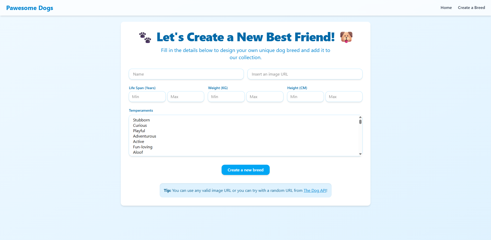

# 🐶 Pawesome Dogs

Pawesome Dogs is a full-stack web application that allows users to explore, filter, sort, and search a wide variety of dog breeds. Users can view breed details and even create their own custom breeds to be added to the catalog.

> 🎓 This was an **individual project** developed during the **Soy Henry bootcamp**. It was built entirely for educational purposes and is not intended for commercial use.

---

## ✨ Features

- 🔎 Search for dog breeds by name  
- 📊 Filter by temperament or origin (API/DB)  
- ↕️ Sort breeds by name or weight  
- 📄 View detailed breed information  
- ➕ Create new dog breeds using a form  
- 🌐 Uses **The Dog API** for external breed data  

---

## 📸 Screenshots

### 🏠 Landing Page  


### 🔍 Breed Catalog


### 📄 Breed Detail  


### ➕ Create New Breed  


---

## ⚙️ Technologies Used

- **Frontend:** React, Redux Toolkit, Tailwind CSS 
- **Backend:** Node.js, Express  
- **Database:** PostgreSQL, Sequelize  
- **API Consumption:** The Dog API  
- **Other:** dotenv, axios, etc.  

---

## 🚀 Getting Started

### 1. Clone the repository

```bash
git clone https://github.com/Shaikohn/Pawesome-Dogs.git
cd Pawesome-Dogs

```

### 2. Install dependencies

```bash
# client
cd client
npm install

# api
cd ../api
npm install

```

### 3. Setup your .env file
Create a .env file inside the api/ directory with the following variables:

```bash

DB_USER=your_db_user
DB_PASSWORD=your_db_password
DB_HOST=your_db_host
DB_NAME=your_db_name
PORT=your_desired_port
API_KEY=your_dog_api_key

```

### 4. Run Locally

```bash

# Start backend
cd api
npm start

# Start frontend
cd ../client
npm start


```

## 🙌 Credits
This project was developed individually as part of the final individual project for the full-stack web development bootcamp at Soy Henry.

All data and functionalities are intended for learning and simulation only.